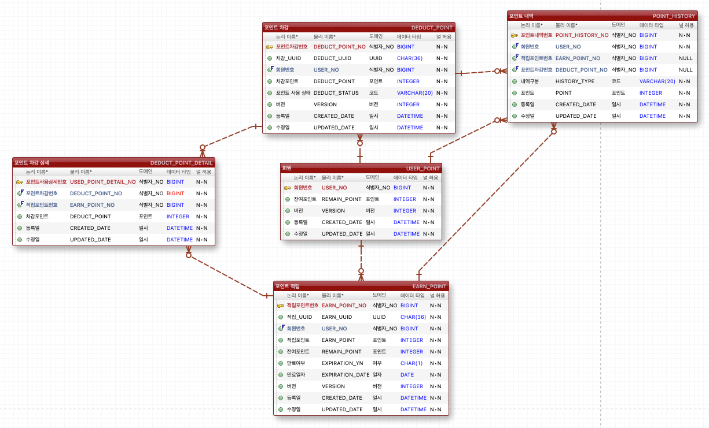

# 프로젝트 실행 및 API 호출

## gradle 서버 실행

```shell
# 실행
./gradlew :point-api:bootRun

# jar 생성 및 실행
./gradlew clean :point-api:buildNeeded --stacktrace --info --refresh-dependencies -x test -x asciidoctor
java -jar ./point-api/build/libs/point-api-*.jar 
```

## jar 다운로드 및 서버 실행

- [jar 다운로드](https://github.com/seolys/point/blob/main/point-api.jar)
- 다운받은 jar 실행
  ```shell
  java -jar point-api.jar
  ```

## API 호출

- http-test 디렉토리의 .http 파일 또는 [Spring Rest Docs(서버 실행 후 클릭)](http://localhost:8500/docs/index.html)


# 프로젝트 설명

- JAVA 11, SpringBoot
- 멀티 모듈로 구성하여 레이어 간 의존성을 분리.<br/>ex) batch 모듈을 추가한다면 domain, infra 모듈을 재활용 가능할 것이라 기대.
- Redis를 활용하여 회원별 포인트 조회 시 서버 부하 최소화<br/>RDBMS와 Redis의 데이터를 동기화하기 위해 @TransactionListener를 활용하여 Commit이 일어났을 경우에만 Redis에 증감내용을 갱신.<br/>Redis에 잔여
  포인트를 덮어쓰는 것이 아니라 증감내용만 갱신하기 때문에 RDBMS와 불일치 요소를 줄임.
    ```
    # 포인트 300 증가
    redis> incrby user:1:point:remain 300
      
    # 포인트 5000 감소
    redis> incrby user:1:point:remain -5000
    ```
- 포인트 적립, 사용, 사용취소 요청을 받을때 식별자를 넘겨받아 중복으로 처리되지 않도록함.
- 낙관적 락을 사용. 충돌이 발생할 경우 retry를 통해 실패한 요청을 재시도.
- Spring Rest Docs [Spring RestDocs](http://localhost:8500/docs/index.html)를 활용.
  

# Entity Relationship Diagram



- 적립 시 유효기간을 고려. 배치 서버에서 만료일에 도달한 포인트를 만료시킬 수 있음.
- 사용취소 시 복구하기 위해서 사용취소 시점의 포인트를 저장.
- 적립, 사용, 취소에 대한 내용을 저장.

# API Spec

## 1. 회원별 포인트 조회

### curl request

```curl
curl 'http://localhost:8500/api/v1/points/1' -i -X GET \
-H 'Content-Type: application/json'
```

### HTTP response

```
HTTP/1.1 200 OK
Content-Type: application/json
Content-Length: 90

{
  "code" : "0000",
  "message" : "Success",
  "data" : {
    "remainPoint" : 24000
  }
}
```

## 2. 회원별 포인트 적립/사용내역 조회

### curl request

```curl
curl 'http://localhost:8500/api/v1/points/1/history' -i -X GET \
-H 'Content-Type: application/json'
```

### HTTP response

```
HTTP/1.1 200 OK
Content-Type: application/json
Content-Length: 223

{
  "code" : "0000",
  "message" : "Success",
  "data" : {
    "history" : [ {
      "pointHistoryNo" : 6,
      "historyType" : "EARN",
      "point" : 1000,
      "createdDate" : "2022-10-04T23:16:38.452989"
    } ]
  }
}
```

## 3. 회원별 포인트 적립

### curl request

```curl
curl 'http://localhost:8500/api/v1/points/1/earn' -i -X POST \
    -H 'Content-Type: application/json' \
    -d '{
  "uuid" : "c091872e-b9a7-4e5c-b9e8-bac56f42e582",
  "point" : 1000
}'
```

### HTTP response

```
HTTP/1.1 200 OK
Content-Type: application/json
Content-Length: 46

{
  "code" : "0000",
  "message" : "Success"
}
```

## 4. 회원별 포인트 사용

### curl request

```curl
curl 'http://localhost:8500/api/v1/points/1/deduct' -i -X POST \
    -H 'Content-Type: application/json' \
    -d '{
  "uuid" : "d607c562-f84e-4f32-bde4-4a598b47f979",
  "point" : 1000
}'
```

### HTTP response

```
HTTP/1.1 200 OK
Content-Type: application/json
Content-Length: 88

{
  "code" : "0000",
  "message" : "Success",
  "data" : {
    "deductPointNo" : 2
  }
}
```

## 5. 회원별 포인트 사용 취소

### curl request

```curl
curl 'http://localhost:8500/api/v1/points/1/cancel-deduct' -i -X POST \
    -H 'Content-Type: application/json' \
    -d '{
  "deductPointNo" : 1
}'
```

### HTTP response

```
HTTP/1.1 200 OK
Content-Type: application/json
Content-Length: 46

{
  "code" : "0000",
  "message" : "Success"
}
```

# 테스트 코드 수행 결과


